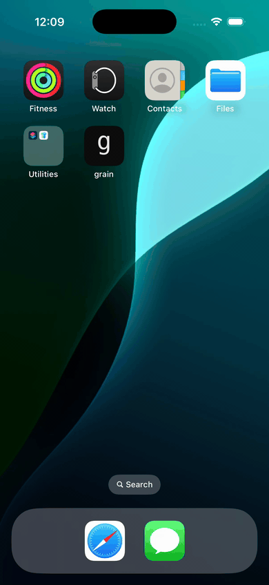

# Changelog

All notable changes to Grain are documented in this file.

The format follows [Keep a Changelog](https://keepachangelog.com/en/1.1.0/).  
Versions follow [Semantic Versioning](https://semver.org/).

---

## [Unreleased]

### Added
- Notifications-based launch screen for returning users with recent activity cards and a fast handoff into the main app
- GitHub Actions Build workflow (`build.yml`) that runs iOS simulator build and tests on pushes and pull requests to `main`

  

### Planned
- Wire "+" toolbar button to manual receipt entry form
- Wire "Edit" button on scan preview
- Persist receipt image to `Receipt.imageData`
- Replace silent `print()` error handling with user-facing alerts
- Export Data (CSV / JSON)
- Import Bank Transactions (OFX/QFX)
- Tax Categories configuration
- Deduction Rules configuration
- Unit tests for `AnalyticsService`
- Enable CloudKit sync (see [ADR-0005](docs/adr/ADR-0005-local-only-storage.md))

---

## [0.1.0] — 2025

### Added
- **Receipt scanning** — camera capture via VisionKit + on-device OCR via Vision framework
- **Receipt list** — chronological list with merchant name, date, and total; swipe-to-delete
- **Receipt detail** — itemised breakdown; editable merchant, address, category, notes, date
- **Analytics** — spending breakdown by category, brand, and merchant with weekly/monthly/quarterly/yearly selector (Swift Charts)
- **Products & Brands** — auto-populated catalog from scanned receipts; price history tracking via `PricePoint`
- **Settings scaffold** — placeholder UI for Export Data, Import Bank Transactions, Tax Categories, Deduction Rules
- **SwiftData models** — `Receipt`, `ReceiptItem`, `Product`, `PricePoint`, `Brand`, `BankTransaction`, `SpendingAnalytics`
- **CloudKit entitlement** — present in project, not yet active

### Architecture decisions (see [docs/adr/](docs/adr/README.md))
- SwiftUI + SwiftData on iOS 17+ ([ADR-0001](docs/adr/ADR-0001-swiftui-swiftdata.md))
- Apple Vision framework for on-device OCR ([ADR-0002](docs/adr/ADR-0002-vision-framework-ocr.md))
- Zero external dependencies ([ADR-0003](docs/adr/ADR-0003-zero-external-dependencies.md))
- Swift Charts for analytics ([ADR-0004](docs/adr/ADR-0004-swift-charts.md))
- Local-only storage; CloudKit deferred ([ADR-0005](docs/adr/ADR-0005-local-only-storage.md))

### Known issues
- OCR parser (`ReceiptScannerService`) is a proof-of-concept regex approach; accuracy on real-world receipts is limited
- `BankTransaction` model is complete but nothing imports, displays, or matches transactions
- `SpendingAnalytics` is a SwiftData `@Model` but used transiently — should be a plain struct
- No cascading deletes declared on `Receipt` → `ReceiptItem` relationship
- No user-facing error states; all failures are swallowed with `print()`
- `ContentView.swift` and `Item.swift` are unused Xcode template leftovers

---

[Unreleased]: https://github.com/larralapid/grain/compare/v0.1.0...HEAD
[0.1.0]: https://github.com/larralapid/grain/releases/tag/v0.1.0
