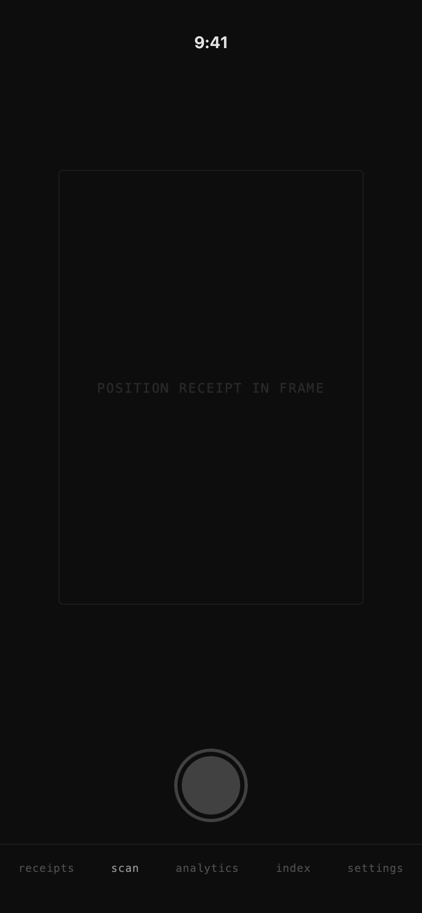
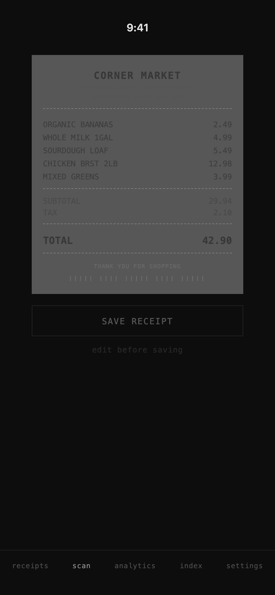
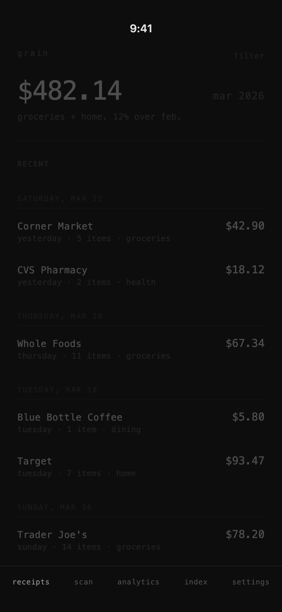
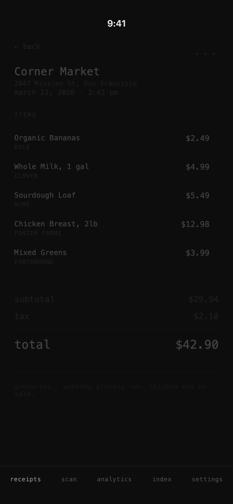
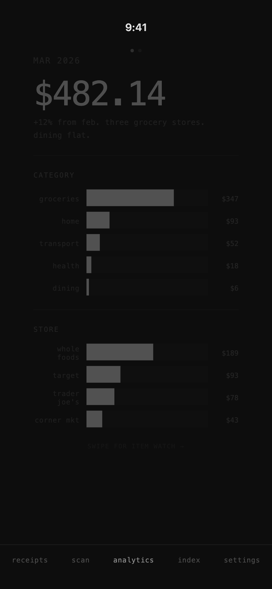
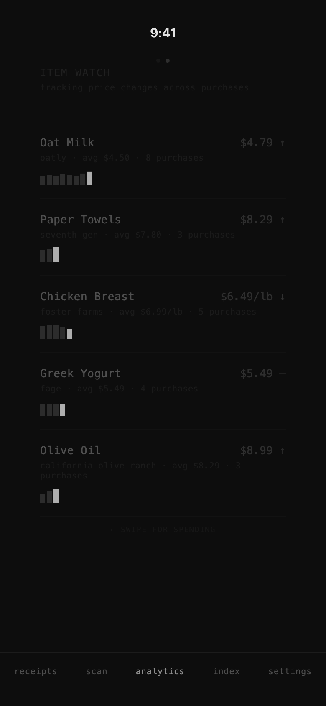
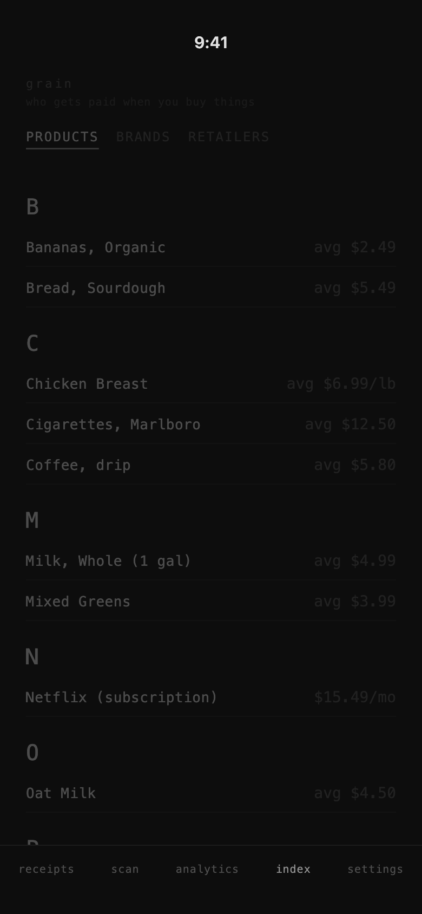
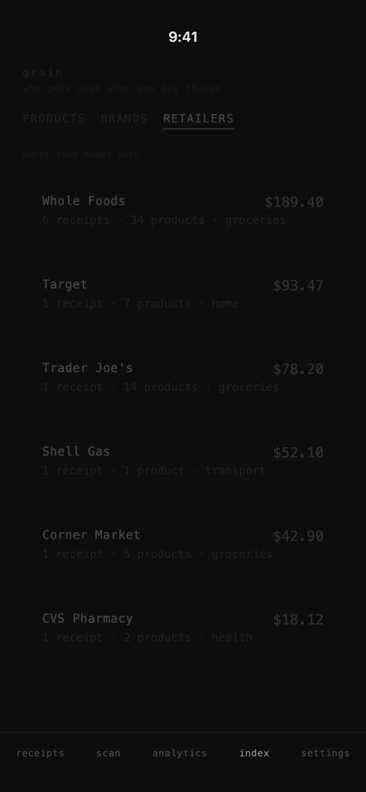

```
▓▓▓▓▓▓▓▓▓▓▓▓▓▓▓▓▓▓▓▓▓▓▓▓▓▓▓▓▓▓▓▓▓▓▓▓▓▓▓▓▓▓▓▓▓▓▓▓▓▓▓▓▓▓▓▓▓▓▓▓
  PROOF-OF-CONCEPT
  core scan + display flow: working
  tech debt + next steps: docs/Current-State.md
▓▓▓▓▓▓▓▓▓▓▓▓▓▓▓▓▓▓▓▓▓▓▓▓▓▓▓▓▓▓▓▓▓▓▓▓▓▓▓▓▓▓▓▓▓▓▓▓▓▓▓▓▓▓▓▓▓▓▓▓
```

grain — local-first iOS receipt scanner. scan · parse · track · analyze.

<!-- dashboard-start -->
<table>
<tr valign="top">

<td width="28%">

<table width="100%"><tr><td bgcolor="000000"><b><samp><font color="white">N&thinsp;A&thinsp;V</font></samp></b></td></tr></table>

|&thinsp;- <a href="#what-it-does">what it does</a><br />
|&thinsp;- <a href="#stack">stack</a><br />
|&thinsp;- <a href="#run-locally">run locally</a><br />
|&thinsp;- <a href="#status">status</a><br />

<br />

<table width="100%"><tr><td bgcolor="000000"><b><samp><font color="white">D&thinsp;O&thinsp;C&thinsp;S</font></samp></b></td></tr></table>

|&thinsp;- <a href="docs/Current-State.md">current state</a><br />
|&thinsp;- <a href="docs/Redesign-Spec.md">redesign spec</a><br />
|&thinsp;- <a href="docs/adr/README.md#index">ADRs</a><br />
|&thinsp;- <a href="CHANGELOG.md">changelog</a><br />

<br />

<table width="100%"><tr><td bgcolor="000000"><b><samp><font color="white">S&thinsp;T&thinsp;A&thinsp;C&thinsp;K</font></samp></b></td></tr></table>

SwiftUI · SwiftData<br />
Apple Vision OCR<br />
Swift Charts<br />
iOS&thinsp;17+ · local-only<br />

</td>

<td width="44%">

<table align="center">
<tr><td colspan="2" bgcolor="000000" align="center"><b><samp><font color="white">S&thinsp;C&thinsp;R&thinsp;E&thinsp;E&thinsp;N&thinsp;S</font></samp></b></td></tr>
<tr>
<td align="center">
<a href="#what-it-does"><br /><sup>scan</sup></a>
</td>
<td align="center">
<a href="#what-it-does"><br /><sup>proof</sup></a>
</td>
</tr>
<tr>
<td align="center">
<a href="#what-it-does"><br /><sup>receipts</sup></a>
</td>
<td align="center">
<a href="#what-it-does"><br /><sup>detail</sup></a>
</td>
</tr>
<tr>
<td align="center">
<a href="#what-it-does"><br /><sup>analytics</sup></a>
</td>
<td align="center">
<a href="#what-it-does"><br /><sup>item watch</sup></a>
</td>
</tr>
<tr>
<td align="center">
<a href="#what-it-does"><br /><sup>index</sup></a>
</td>
<td align="center">
<a href="#what-it-does"><br /><sup>retailers</sup></a>
</td>
</tr>
</table>

</td>

<td width="28%" align="center">

<table width="100%"><tr><td bgcolor="000000" align="center"><b><samp><font color="white">g&thinsp;r&thinsp;a&thinsp;i&thinsp;n</font></samp></b></td></tr></table>

<br />


<br /><br />

[](https://github.com/larralapid/grain/actions/workflows/build.yml)<br />
<br />
<br />
<br />

<br />

<details>
<summary><sup>v0.1.0 · poc</sup></summary>
<br />
<samp>
scan → ocr → parse<br />
save → browse → analyze<br />
local-only · no cloud<br />
</samp>
</details>

</td>

</tr>
</table>
<!-- dashboard-end -->

***

## What it does

- **Scan receipts** — photograph a paper receipt and extract merchant, items, prices, and tax with Apple Vision OCR.
- **Track spending** — view totals and breakdowns by category, merchant, and brand.
- **Watch prices** — see item-level price history across purchases.
- **Index entities** — browse products, brands, and retailers pulled from receipt data.
- **Stay local-first** — all storage and processing on device. No cloud, no accounts.

## Stack

| Layer | Tech |
|---|---|
| UI | SwiftUI |
| Data | SwiftData |
| OCR | Apple Vision |
| Charts | Swift Charts |
| Storage | Local-only |
| Dependencies | Apple frameworks only |

iOS 17+ · Swift 5.9+ · Xcode 15+

## Run locally

```bash
git clone https://github.com/larralapid/grain.git
cd grain
open grain.xcodeproj
```

Build the `grain` target in Xcode and run on an iOS 17+ simulator or device.

## Status

Proof of concept. The core loop exists: scan, OCR, parse, save, browse, and analyze.

Biggest gaps to close for MVP: manual receipt entry, full edit flow from scan proof, receipt image persistence, stronger parser reliability, and better user-facing error states.

See [docs/Current-State.md](docs/Current-State.md) for the full assessment and MVP delta.

## Docs

- [Current State](docs/Current-State.md)
- [Redesign Spec](docs/Redesign-Spec.md)
- [Architecture Decisions](docs/adr/README.md)
- [Changelog](CHANGELOG.md)

## License

All rights reserved. See [LICENSE](LICENSE).
