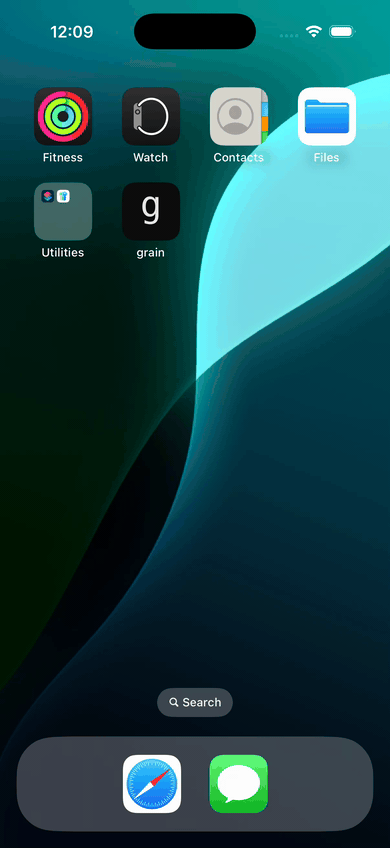

<!-- dashboard-start -->
<table>
<tr valign="top">

<td align="center">


<br />

▓▓▓▓▓▓▓▓▓▓▓▓▓▓▓▓▓▓▓▓▓▓▓▓▓▓▓▓▓▓▓▓▓▓▓▓▓▓▓▓▓▓▓▓▓▓▓▓▓▓▓▓▓
  GRAIN · receipt scanner + expense tracker for iOS                     
▓▓▓▓▓▓▓▓▓▓▓▓▓▓▓▓▓▓▓▓▓▓▓▓▓▓▓▓▓▓▓▓▓▓▓▓▓▓▓▓▓▓▓▓▓▓▓▓▓▓▓▓▓





<details>
<summary><sup>v0.1.0 · poc</sup></summary>
<br />
<samp>
scan → ocr → parse<br />
save → browse → analyze<br />
local-only · no cloud<br />
</samp>
</details>

</td>

<td width="65%">

<table width="100%">


<tr><td colspan="2" align="center"><br /><samp><font color="888888">Enterprise level intelligence for the modern consumer.</font></samp><br /><br /></td></tr>

<tr>
<td width="50%" valign="top" bgcolor="0d0d0d">
<table width="100%"><tr><td><b><samp><font color="white">D&thinsp;O&thinsp;C&thinsp;S</font></samp></b></td></tr></table>
<samp><font color="555555">→&thinsp;</font></samp><a href="docs/Current-State.md"><samp>Current State</samp></a><br />
<sup><font color="555555">parser · errors · images · edit</font></sup>

<samp><font color="555555">→&thinsp;</font></samp><a href="CHANGELOG.md"><samp>changelog</samp></a><br />
<sup><font color="555555">v0.1.0 · poc · notifications</font></sup>

</td>
<td width="50%" valign="top" bgcolor="0d0d0d">
<!-- INSERT SOMETHING -->
</td>
</tr>

<tr><td colspan="2" bgcolor="000000" align="center"><b><samp><font color="white">N&thinsp;O&thinsp;T&thinsp;E&thinsp;S</font></samp></b></td></tr>

<tr>
<td colspan="2" bgcolor="0d0d0d">
## ◈ RUN LOCALLY

```sh
open grain.xcodeproj
```

Build the `grain` target in Xcode and run on an iOS 17+ simulator or device.
</td>
</tr>

</table>

</td>

</tr>
</td>
</tr>
</tbody></table>
<!-- dashboard-end -->
