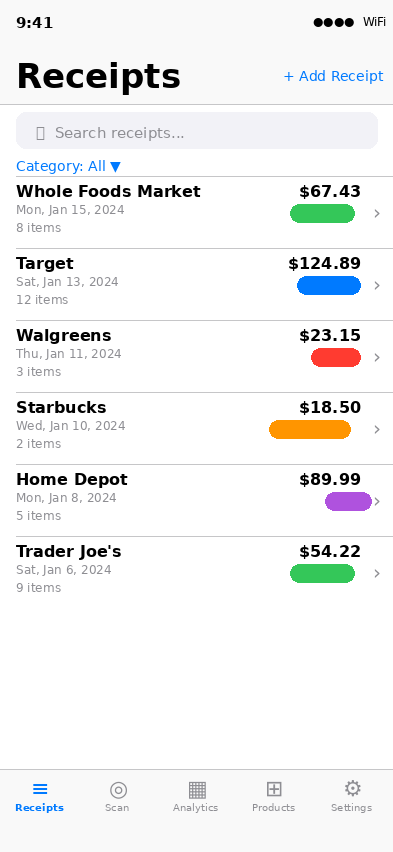
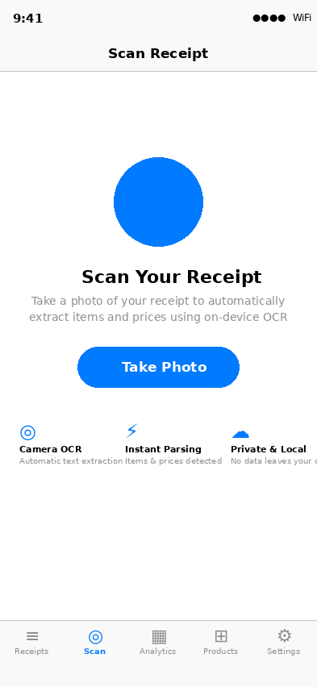
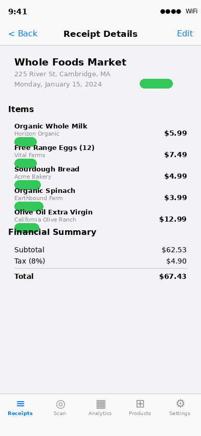
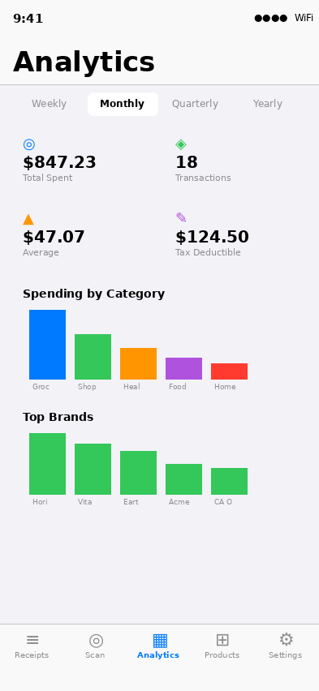
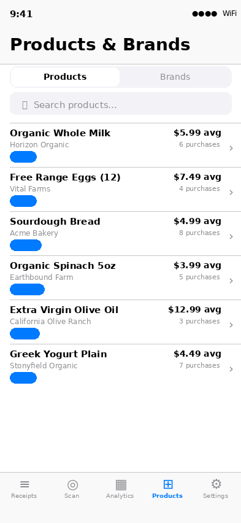
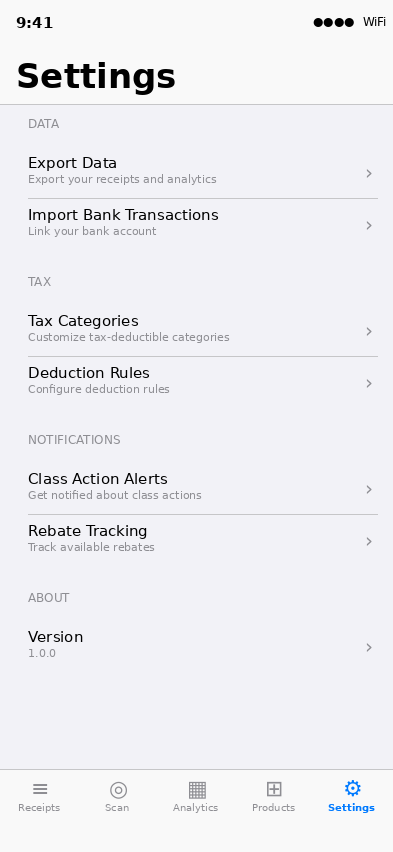
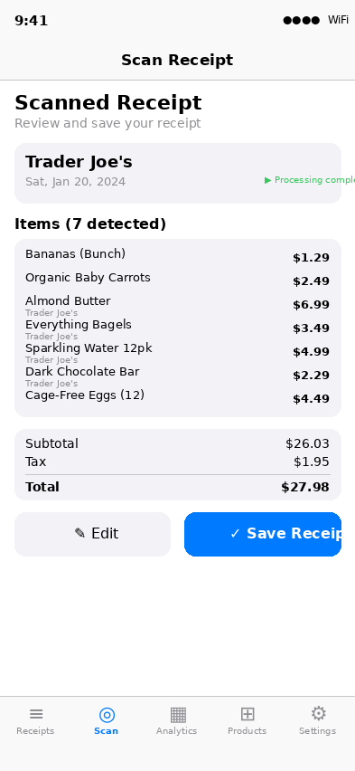
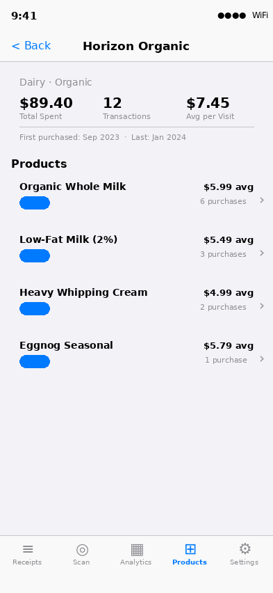

# Grain App – UI Screenshots

Visual documentation of all currently developed features and screens in the Grain iOS receipt scanning and expense tracking app.

---

## 01 · Receipt List

Browse, search, and filter all scanned receipts. Receipts are sorted by date (newest first) and display merchant name, date, item count, total amount, and category badge. Swipe to delete. Filter by category via the dropdown menu.

---

## 02 · Receipt Scanner

Tap **Take Photo** to open the camera and photograph a receipt. On-device Vision Framework OCR automatically extracts all text. Processing happens entirely on-device — no data leaves your device.

---

## 03 · Receipt Detail

Full breakdown of a scanned receipt including merchant info, address, date, category tag, itemized list with brand and category per item, and a financial summary (subtotal, tax, total). Tap **Edit** to correct any OCR errors.

---

## 04 · Analytics Dashboard

Spending insights across Weekly / Monthly / Quarterly / Yearly periods. Overview cards show: Total Spent, Transaction Count, Average Transaction, and Tax-Deductible Amount. Bar charts display spending by Category, Top Brands, and Top Merchants.

---

## 05 · Products & Brands

Auto-populated product catalog extracted from receipt scans. Displays average price, purchase count, brand, and category per product. Toggle to the **Brands** tab for brand-level analytics including total spent and transaction history.

---

## 06 · Settings

Configuration hub with sections for: Data (Export Data, Import Bank Transactions), Tax (Tax Categories, Deduction Rules), Notifications (Class Action Alerts, Rebate Tracking), and About (app version).

---

## 07 · Scan Preview (Post-OCR)

After scanning, the app presents a preview of all detected items and prices before saving. Users can tap **Edit** to correct details or **Save Receipt** to persist to the local SwiftData database.

---

## 08 · Brand Detail

Drill-down view for a specific brand showing total spend, transaction count, average per visit, purchase date range, and the full list of products purchased from that brand with individual pricing history.
