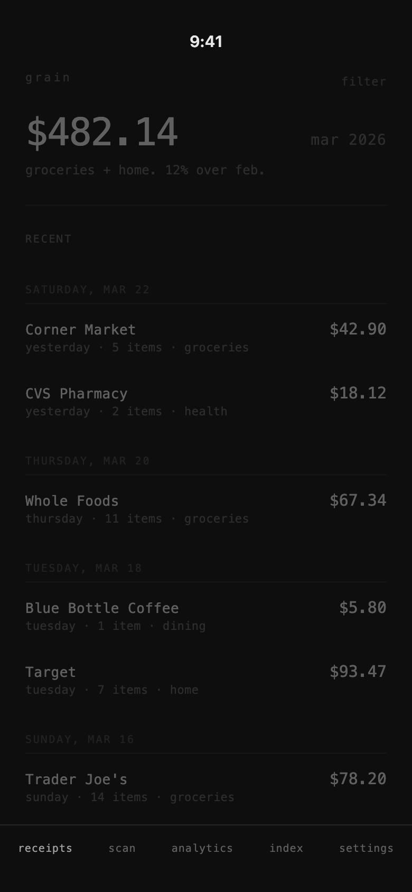
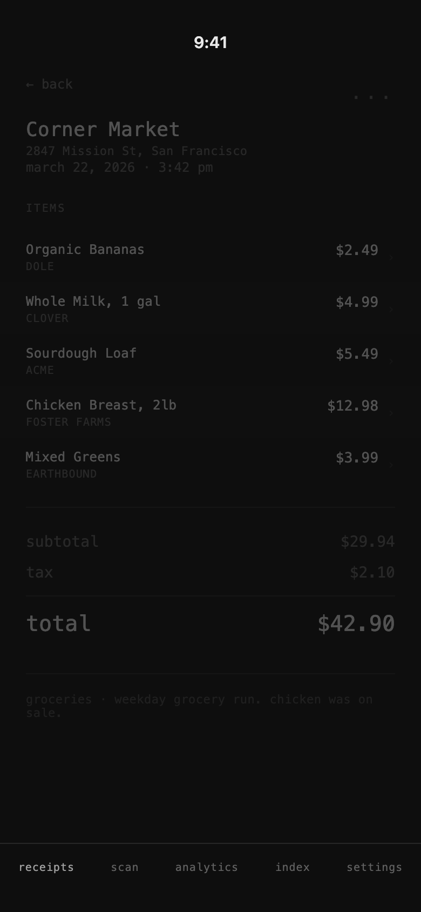
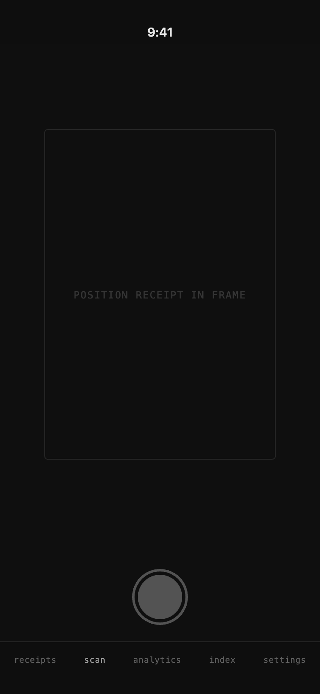
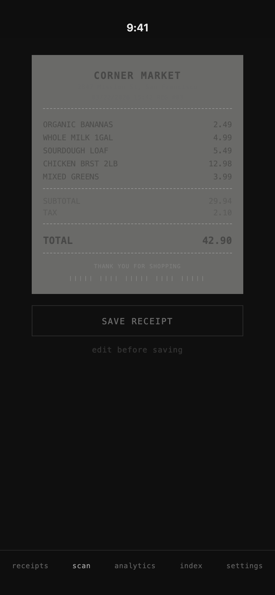
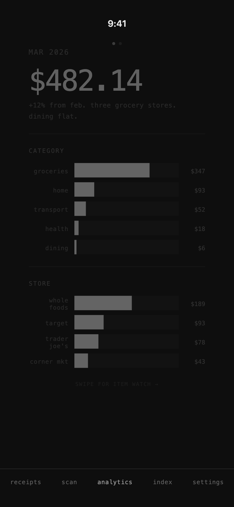
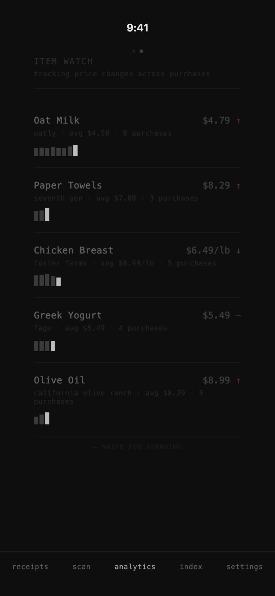
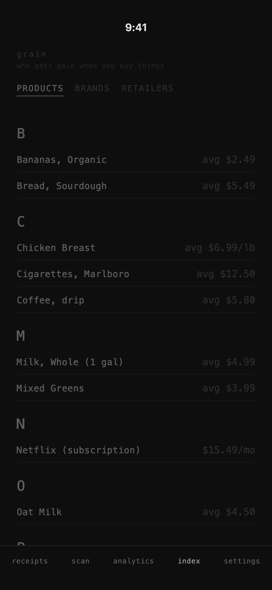
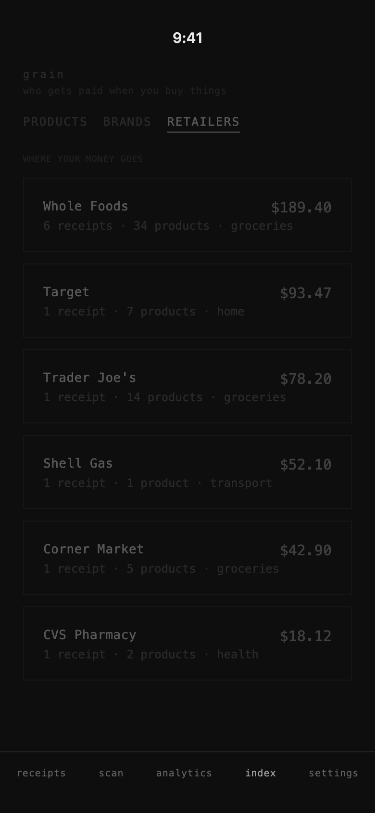

# Grain App – UI Screenshots

Visual documentation of all currently developed screens in the Grain iOS receipt scanning and expense tracking app.

---

## 01 · Home

Receipt list with monthly spending summary at top ($482.14 for Mar 2026, with category breakdown and month-over-month comparison). Recent receipts grouped by date showing merchant name, relative day, item count, category, and total. Filter option in the top-right corner. Five-tab navigation bar at bottom: receipts, scan, analytics, index, settings.

---

## 02 · Receipt Detail

Full breakdown of a scanned receipt: merchant name (Corner Market), address, date and time. Itemized list with product name, brand, and price per item. Financial summary with subtotal, tax, and total. Category tag and notes at the bottom.

---

## 03 · Scan

Camera viewfinder with a receipt alignment frame and "POSITION RECEIPT IN FRAME" guidance text. Shutter button at the bottom. On-device Vision Framework OCR processes the captured image — no data leaves the device.

---

## 04 · Scan Proof

Post-scan thermal receipt preview showing extracted data styled as a paper receipt: merchant name, itemized list with prices, subtotal, tax, total, and a barcode. **SAVE RECEIPT** button to persist to SwiftData, with an "edit before saving" option below.

---

## 05 · Analytics – Spending

Monthly spending overview with total amount and natural-language summary. Horizontal bar charts for Category breakdown (groceries, home, transport, health, dining) and Store breakdown (Whole Foods, Target, Trader Joe's, Corner Market). Swipeable to Item Watch page.

---

## 06 · Analytics – Item Watch

Price tracking across purchases for frequently bought items. Each entry shows product name, brand, current price, average price, purchase count, price trend indicator (up/down/flat), and a mini spark-bar history. Swipeable back to Spending page.

---

## 07 · Index – Products

Alphabetical product catalog extracted from receipt scans. Three tabs: **PRODUCTS**, **BRANDS**, **RETAILERS**. Products tab shows items grouped by first letter with average price per product. Tagline: "who gets paid when you buy things."

---

## 08 · Index – Retailers

Retailer directory sorted by total spend. Each card shows retailer name, receipt count, product count, primary category, and total amount. Subtitle: "WHERE YOUR MONEY GOES."
