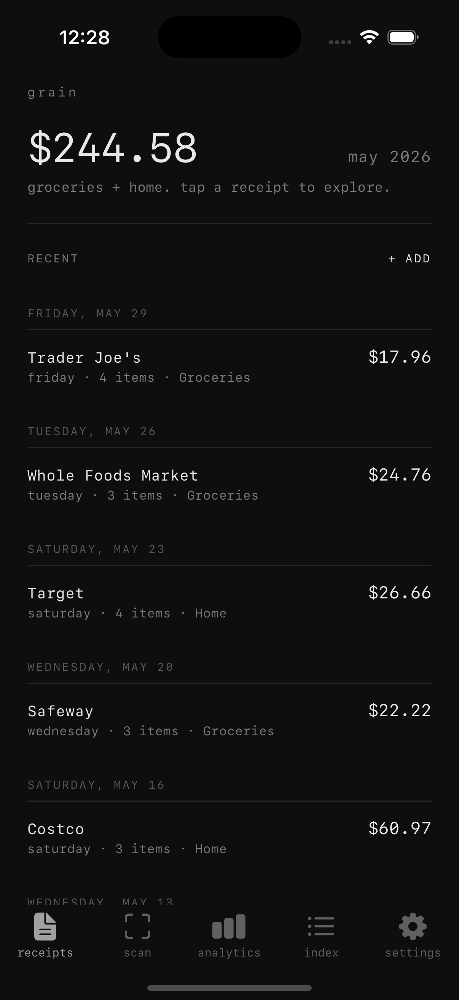
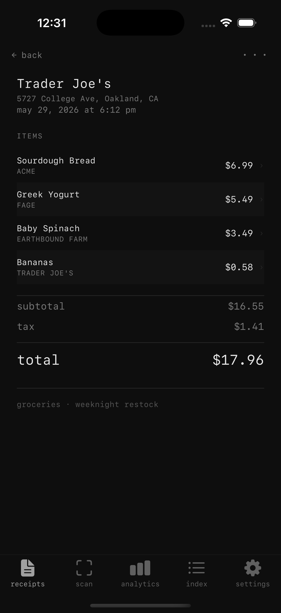
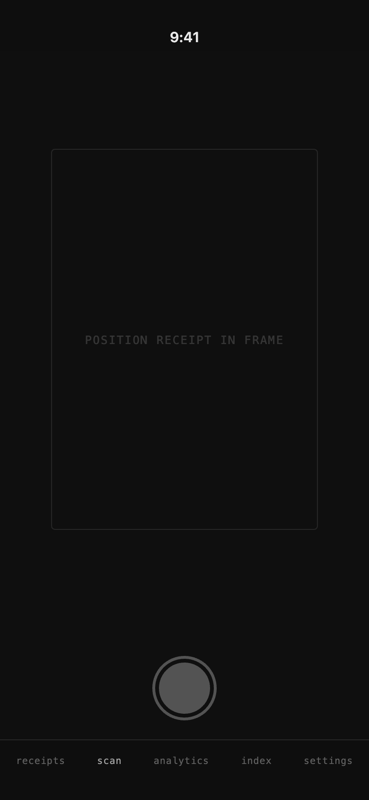
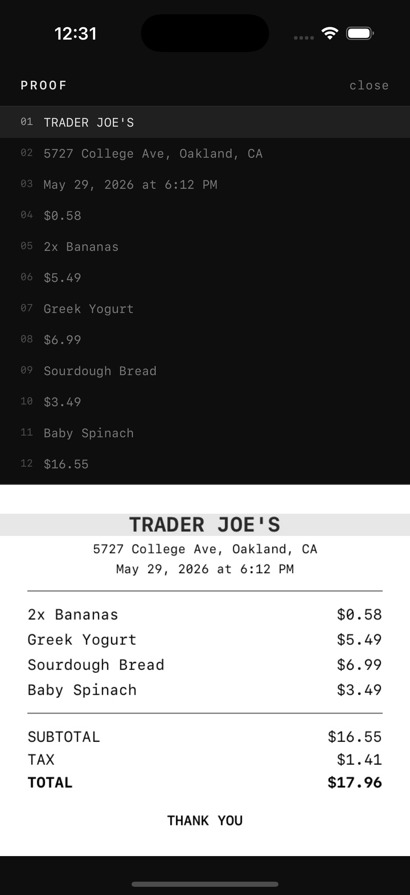
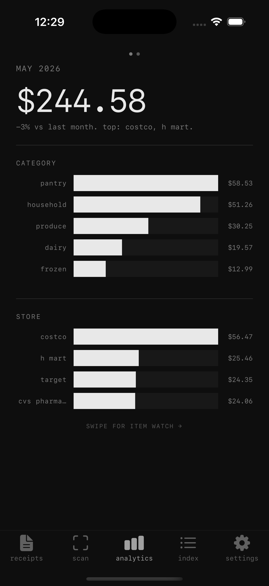
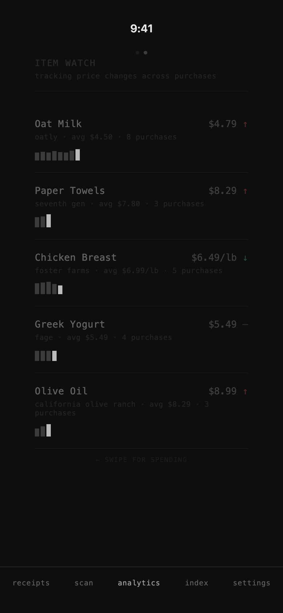
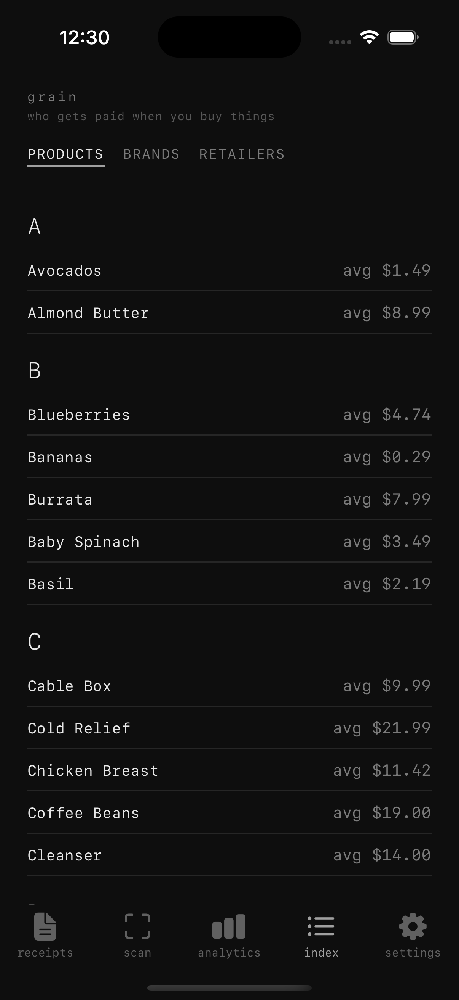
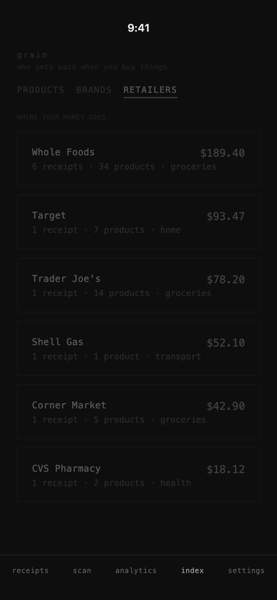

# Grain App – UI Screenshots

Visual documentation of the currently developed screens in the Grain iOS receipt scanning and expense tracking app.

> **Note:** 01, 02, 04, 05, 07 are refreshed from the current UI (May 2026, seeded demo data). 03 · Scan, 06 · Item Watch, and 08 · Retailers are **pending a refresh** (pre-redesign captures) — they need the running simulator to recapture.

---

## 01 · Home

Receipt list with the live monthly spending summary at the top ($244.58 for May 2026) and a one-line natural-language summary. Recent receipts are grouped by date, each showing merchant, relative day, item count, category, and total. `+ ADD` opens manual entry. Five-tab navigation bar at the bottom: receipts, scan, analytics, index, settings.

---

## 02 · Receipt Detail

Full breakdown of a receipt (Trader Joe's): merchant, address, date and time. Itemized list with the **brand per item** (ACME, FAGE, Earthbound Farm…) — the granular value prop. Financial summary with subtotal, tax, and total, plus a category and notes line.

---

## 03 · Scan

Camera viewfinder with a receipt alignment frame and "POSITION RECEIPT IN FRAME" guidance. On-device Vision-framework OCR processes the captured image — no data leaves the device. _(Pre-redesign capture — pending refresh.)_

---

## 04 · Proof – Split View

The "proof" view (now promoted to the top of a receipt's overflow menu). Top pane: the digital OCR lines, numbered, re-recognized from the scanned image. Bottom pane: the scanned receipt itself. Tapping a line moves a translucent cursor over the matching region of the image — the receipt and its extracted data, side by side.

---

## 05 · Analytics – Spending

Monthly spending overview ($244.58, May 2026) with a real month-over-month change and top stores. Horizontal bar charts for Category (pantry, household, produce, dairy, frozen) and Store (costco, h mart, target, cvs) — both on one itemized basis so they reconcile. Swipeable to the Item Watch page.

---

## 06 · Analytics – Item Watch

Price tracking across purchases for frequently bought items. Each entry shows product, brand, current price, average price, purchase count, a trend indicator (up/down/flat), and a mini spark-bar history. Swipeable back to Spending. _(Pre-redesign capture — pending refresh.)_

---

## 07 · Index – Products

Alphabetical product catalog built from real scans (avg price per product). Three tabs: **PRODUCTS**, **BRANDS**, **RETAILERS**. Tagline: "who gets paid when you buy things."

---

## 08 · Index – Retailers

Retailer directory sorted by total spend. Each card shows retailer name, receipt count, product count, primary category, and total. Subtitle: "WHERE YOUR MONEY GOES." _(Pre-redesign capture — pending refresh.)_
